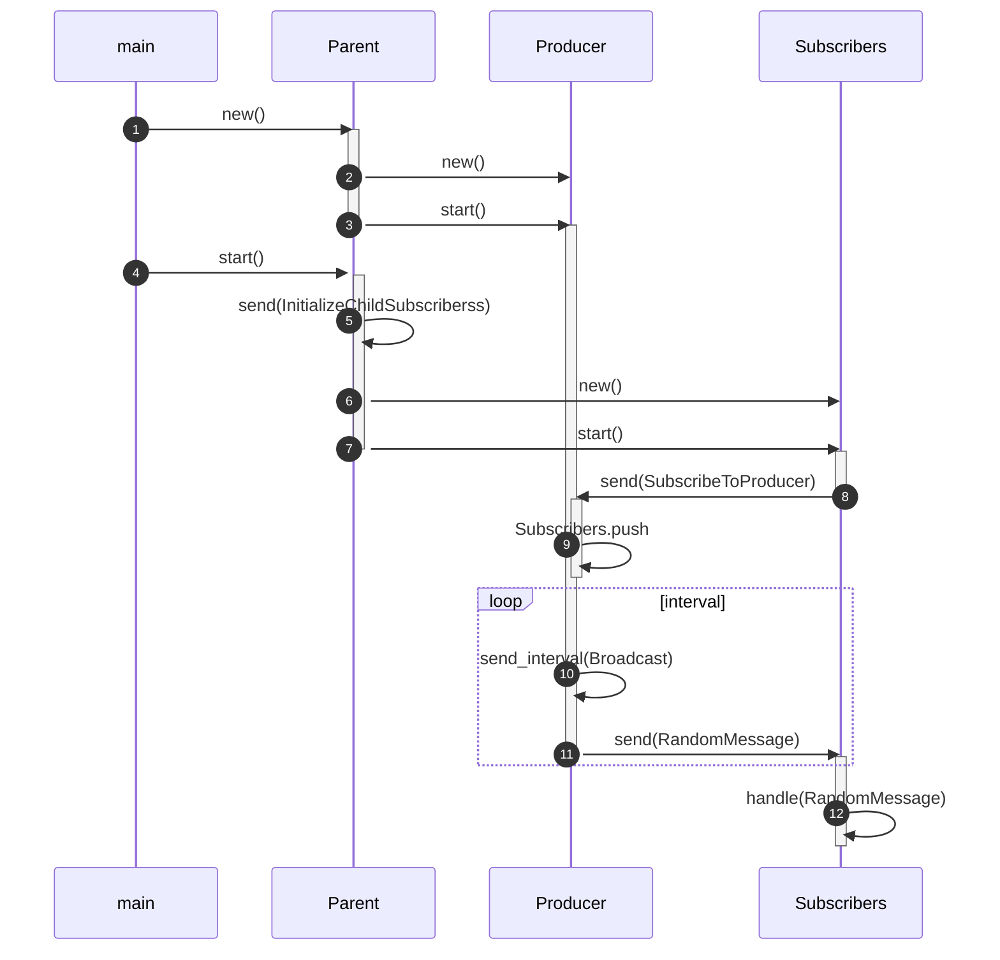

```mermaid
sequenceDiagram
    autonumber
    main ->> Parent: new()
    activate Parent
    Parent ->> Producer: new()
    Parent ->> Producer: start()
    deactivate Parent
    activate Producer
    main ->>+ Parent: start()
    activate Parent
    Parent ->> Parent: send(InitializeChildSubscriberss)
    Parent ->> Subscribers: new()
    Parent ->> Subscribers: start()
    deactivate Parent
    activate Subscribers
    Subscribers ->> Producer: send(SubscribeToProducer)
    deactivate Subscribers
    activate Producer
    Producer ->> Producer: Subscribers.push
    deactivate Producer
    loop interval
        Producer ->> Producer: send_interval(Broadcast)
        Producer ->> Subscribers: send(RandomMessage)
        deactivate Producer
        activate Subscribers
    end
    Subscribers ->> Subscribers: handle(RandomMessage)
    deactivate Subscribers
```